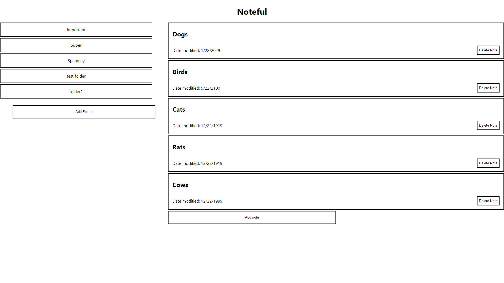
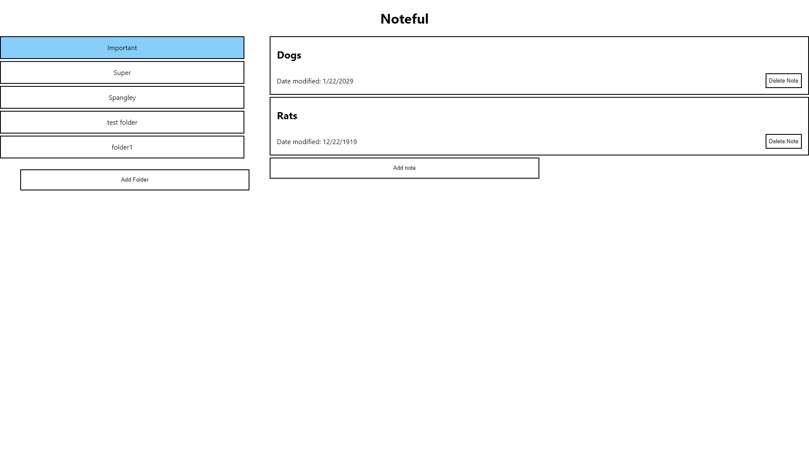
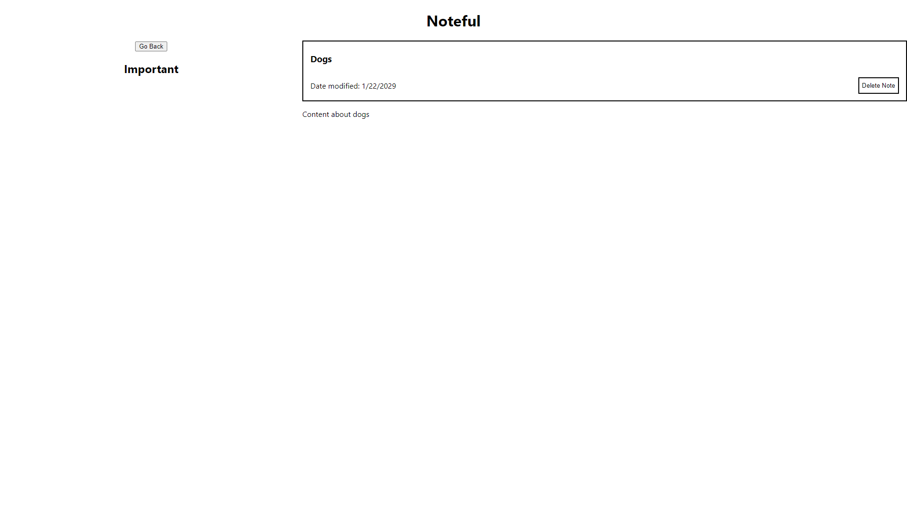

# Noteful  

A simple app that allows users to group their notes into folders, view them all at once, or view individual notes in more detail. The selected folder is highlighted so that users can 
more easily distinguish what the current active folder is. Each note also has a back button to enforce specifc routing for the user. This is my first full stack project and does not 
make use of account specific information.

This is the front-end client of the full-stack Noteful application. You can view it live [here](https://noteful-tau-woad.vercel.app)!  

To check out the app, you can create your own notes and add it to your desired folder.

### Home Page With All Folders and Notes
  

### Selected Folder View
  

### Selected Note View
  

### Technology Used
- React
  - Create React App
  - React Router
- HTML 5
- CSS
- Vercel

### Back-end
This client should be used in conjunction with the API made for this project which can be found [here](https://github.com/Human437/noteful-server).